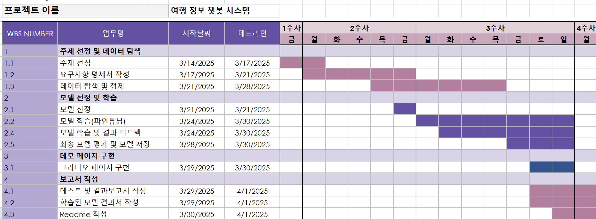

# [SKN09-3rd-2Team]
✅ SKN AI FAMILY CAMP 9기 

---
# 🔊Contents

1. 팀 소개
2. 프로젝트 개요
3. 기술 스택 & 사용한 모델 (임베딩 모델, LLM)
4. 시스템 아키텍처
5. WBS
6. 요구사항 명세서
7. 수집한 데이터 및 전처리 요약
8. DB 연동 구현 코드 (링크만)
9. 테스트 계획 및 결과 보고서
10. 진행 과정 중 프로그램 개선 노력
11. 수행결과(테스트/시연 페이지)
12. 한 줄 회고

---

# 🎙️Team Introduce
### 🎃팀명: 트래블 체커 🍀 
### 🐱팀원

| 윤 환 | 이세진 | 이재혁 | 허정윤 |
|------|------|------|------|
| [@MNYH](https://github.com/MNYH) | [@sejin](https://github.com/tpwls9494) | [@ohdyo](https://github.com/ohdyo) | [@jy](https://github.com/devunis) |
---

# 🎼Project Overview
✅ **프로젝트 기간: 2025.03.28 - 2025. 03.31**

## 1. 프로젝트 주제
#### ✈️ 여행 정보 챗봇 시스템

## 2. 프로젝트 소개
#### 프로젝트 필요성

 

**출처**  
- [에어부산 화재원인은 보조배터리?…지난달에도 비슷한 사고 있어(종합)](https://www.yna.co.kr/view/AKR20250129029651003)
- [[이건왜] 비행기 내 보조배터리, 더 위험한 이유](https://www.sisajournal-e.com/news/articleView.html?idxno=409149)

#### 프로젝트 목표
- **여행 정보 제공** 
  - 여행 정보 챗봇 시스템은 사용자에게 항공 수하물 규정, 현지 문화 등 여행 관련 정보를 제공.
- **AI 기반 대화형 서비스** 
  - AI를 활용하여 자연스럽고 대화형으로 정보를 전달, 사용자가 쉽게 이해하고 활용할 수 있도록 지원.
- **사용자 맞춤형 응답** 
  - 사용자의 질문과 필요에 따라 개인화된 정보를 제공하여 여행 경험을 최적화.

=> 최종적으로 개개인이 원하는 여행 취지에 맞게 궁금한 요소를 해결해주는 **해결사 역할**을 해준다. 

  

## 3. 기술 스택 & 사용한 모델 (임베딩 모델, LLM)
## 🧰 기술 스택 및 사용한 모델

- 개발 언어:  
- 개발 환경:   
- VectorDB :  
- LLM : 
- 프레임워크 :  
- 협업 툴 : 

 

## 4. 시스템 아키텍처

 

## 5. WBS

 

## 6. 요구사항 명세서

 

 

## 7. 수집한 데이터 및 전처리 요약
- 수집한 데이터의 개행, 링크, 출처등과 관련된 일반적인 전처리 진행

| 순서 | 내용                   | 설명 |
|------|------------------------|------|
| 1    | `\xa0` → 공백 치환      | PDF에서 자주 나타나는 비표준 공백을 일반 공백으로 치환 |
| 2    | URL 제거               | `http`로 시작하는 웹 링크를 삭제 |
| 3    | 공백 정리              | 연속된 공백 및 줄바꿈, 탭 등을 하나의 공백으로 정리 |
| 4    | 특수 문자 제거         | 한글, 영문, 숫자, 일부 구두점을 제외한 특수 문자 제거 |
| 5    | 양쪽 공백 제거         | 문자열의 좌우 공백 제거 |

 

## 8. DB 연동 구현 코드 (링크만)
- 랭 스미스 들어가야하는곳

 

## 9. 테스트 계획 및 결과 보고서
- 학습을 통한 자연스러운 응답 도출
- 학습된 내용이 아닌 경우 부정형 응답 도출

 

## 10. 진행 과정 중 프로그램 개선 노력
- 초기 파인튜닝 학습 중 학습률 문제 발생

  1. 초기 학습 단계에서 모델의 학습률이 비정상적으로 낮게 나타나는 문제가 있었음

  2. 원인 분석 결과, 학습에 필요한 데이터 양이 부족하다고 판단하여 다양한 출처로부터 추가 데이터를 지속적으로 수집

  3. LoRA 세부 설정값(loraconfig)의 파라미터를 조정하여 모델 학습 효율 개선 시도 (특히 r값, alpha 값, dropout 비율 등 변경)
- 학습 종료 후 성능 검증 및 응답 품질 향상 시도

  1. 학습이 정상적으로 완료되었는지 확인하기 위해 테스트 질의 응답을 다수 수행

  2. 학습된 데이터 외 새로운 키워드나 질문에 대해 부정형 응답(정보가 없음을 알려주는 응답)이 자연스럽게 나오도록 프롬프트 구조와 거절 응답 데이터 추가 조정

  3. 부정형 응답의 정확도를 높이기 위해 프롬프트 내 거절 의도를 명확히 전달하도록 문구 수정

  4. 학습 데이터와 테스트 데이터를 지속적으로 비교하며 가중치와 파인튜닝 설정값을 재조정

  

## 11. 수행결과(테스트/시연 페이지)

  

# 🎶결론
- 사용자 질문에 대해 자연스럽고 정확한 답변을 제공할 수 있도록 학습 데이터를 기반으로 응답 시스템을 완성하였음

- 제한된 정보나 학습되지 않은 키워드에 대해서는 명확한 거절 응답을 제공하도록 설정하여 사용자 혼란을 최소화하였음

- 궁극적으로 사용자가 여행을 계획할 때 필요한 정보와 유용한 팁을 빠르고 편리하게 얻을 수 있도록 지원하는 시스템을 구현하였음

  

## 향후 과제
- 아직 수집되지 않은 국가별 입국 절차, 문화 정보 등 추가 데이터 확보

- 챗봇 사용성 향상을 위한 지속적인 데이터 정제 및 추가 학습 진행

- 실제 사용자 피드백을 바탕으로 Q&A 데이터 개선 및 고도화

  

# 🎧한 줄 회고
- 윤환 : 
- 이세진 : 
- 이재혁 :
- 허정윤 :
