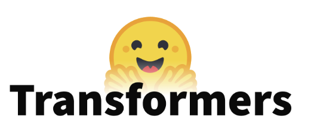
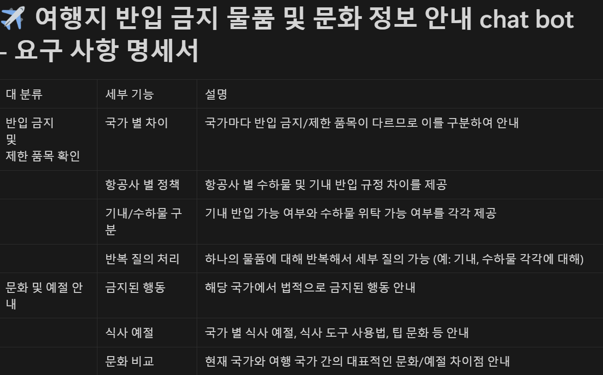
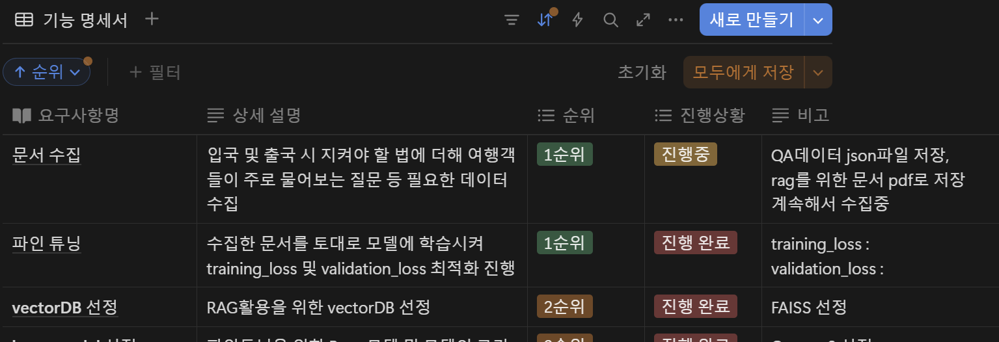

# [SKN09-3rd-2Team]
✅ SKN AI FAMILY CAMP 9기 

---
# 🔊Contents

1. 팀 소개
    - 팀명 : Travel chcker
    - 멤버 개인 깃허브 계정과 연동

2. 프로젝트 개요
    - 프로젝트 명
    - 프로젝트 소개
    - 프로젝트 필요성(배경) 
    - 프로젝트 목표
3. 기술 스택 & 사용한 모델 (임베딩 모델, LLM)
4. 시스템 아키텍처
5. WBS
6. 요구사항 명세서
7. 수집한 데이터 및 전처리 요약
8. DB 연동 구현 코드 (링크만)
9. 테스트 계획 및 결과 보고서
10. 진행 과정 중 프로그램 개선 노력
11. 수행결과(테스트/시연 페이지)
12. 한 줄 회고

---

# 🎙️Team Introduce
### 🎃팀명: 트래블 체커 🍀 
### 🐱팀원

| 윤 환 | 이세진 | 이재혁 | 허정윤 |
|------|------|------|------|
| [@MNYH](https://github.com/MNYH) | [@sejin](https://github.com/tpwls9494) | [@ohdyo](https://github.com/ohdyo) | [@jy](https://github.com/devunis) |

---

# 🎼Project Overview
✅ **프로젝트 기간: 2025.03.28 - 2025. 03.31**

## 1. 프로젝트 주제
#### ✈️ 여행 정보 챗봇 시스템

## 2. 프로젝트 소개
#### 프로젝트 필요성

 

<a href="https://www.sisajournal-e.com/news/articleView.html?idxno=409149">기사 링크</a>

#### 프로젝트 목표
- **여행 정보 제공** 
  - 여행 정보 챗봇 시스템은 사용자에게 항공 수하물 규정, 현지 문화 등 여행 관련 정보를 제공.
- **AI 기반 대화형 서비스** 
  - AI를 활용하여 자연스럽고 대화형으로 정보를 전달, 사용자가 쉽게 이해하고 활용할 수 있도록 지원.
- **사용자 맞춤형 응답** 
  - 사용자의 질문과 필요에 따라 개인화된 정보를 제공하여 여행 경험을 최적화.

=> 최종적으로 개개인이 원하는 여행 취지에 맞게 궁금한 요소를 해결해주는 **해결사 역할**을 해준다. 

  

## 3. 기술 스택 & 사용한 모델 (임베딩 모델, LLM)
## 🧰 기술 스택 및 사용한 모델

- 개발 언어:  
- 개발 환경:   
- VectorDB :  
- LLM : 
- 프레임워크 :  
- 협업 툴 : 

<!-- |   **분류**   |   **개발 언어**   |     **개발 환경**     |       **임베딩**       |      **LLM**       |   **프레임워크**   |   **기타 도구**   |
|:------------:|:-----------------:|:----------------------:|:----------------------:|:------------------:|:------------------:|:------------------:|
| **기술** |  |    |   |  |  |   | -->

 

## 4. 시스템 아키텍처

 

## 5. WBS

 

## 6. 요구사항 명세서

 

 

## 7. 수집한 데이터 및 전처리 요약
- 수집한 데이터의 개행, 링크, 출처등과 관련된 일반적인 전처리 진행

| 순서 | 내용                   | 설명 |
|------|------------------------|------|
| 1    | `\xa0` → 공백 치환      | PDF에서 자주 나타나는 비표준 공백을 일반 공백으로 치환 |
| 2    | URL 제거               | `http`로 시작하는 웹 링크를 삭제 |
| 3    | 공백 정리              | 연속된 공백 및 줄바꿈, 탭 등을 하나의 공백으로 정리 |
| 4    | 특수 문자 제거         | 한글, 영문, 숫자, 일부 구두점을 제외한 특수 문자 제거 |
| 5    | 양쪽 공백 제거         | 문자열의 좌우 공백 제거 |

 

## 8. DB 연동 구현 코드 (링크만)
- 랭 스미스 들어가야하는곳

 

## 9. 테스트 계획 및 결과 보고서
- 학습을 통한 자연스러운 응답 도출
- 학습된 내용이 아닌 경우 부정형 응답 도출

 

## 10. 진행 과정 중 프로그램 개선 노력
- 초기 파인튜닝 학습 중 학습률이 제대로 나오지 않아 loraconfig의 파라미터 값을 수정
- 학습된 데이터외 부정형 응답을 위한 프롬포트 조정 및 가중치 조정

  

## 11. 수행결과(테스트/시연 페이지)

  

# 🎶결론
- 학습을 바탕으로 사용자의 자연스러운 질의 응답 도출
- 

  

## 향후 과제
- 아직 수집하지 못한 다른 나라의 데이터 수집

  

# 🎧한 줄 회고
- 윤환 : 
- 이세진 : 
- 이재혁 :
- 허정윤 :
